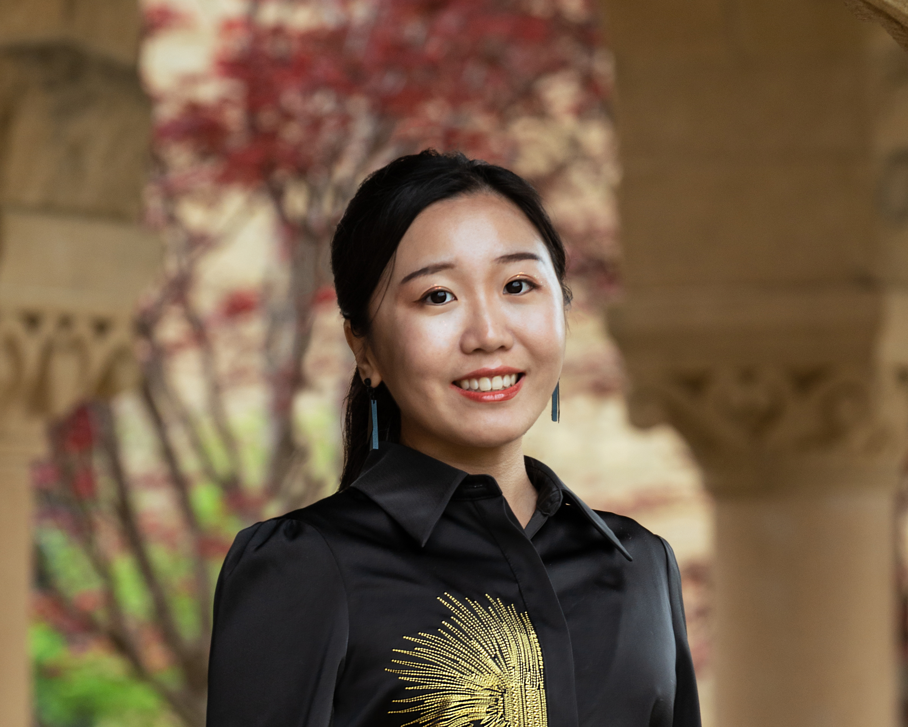

{: width="400" style="float: right"}
Welcome to my home page! My name is Catherine Chen; I am an Assistant Professor in Political Communication at both [the Manship School of Mass Communication](https://www.lsu.edu/manship/index.php) and [the Department of Political Science](https://www.lsu.edu/hss/polisci/) at Louisiana State University. I am also honored to be appointed to the prestigious Mary P. Poindexter Endowed Professorship. 

My research interests revolve around **understanding the antecedents, structure, and consequences of political attitudes among Americans**. Specifically, my work focuses on examining **people's attitudes toward science and technologies**. My methodological toolkit encompasses a range of techniques, including surveys, lab and field experiments, quasi-experiments, and automated text analysis with Large Language Models.

Within this framework, I have been pursuing three interconnected research questions. 
* What are the origins, underlying structure, and implications of **Americans' attitudes toward Science, Health, Environment, and Risk (SHER)**? 
* What are the factors that contribute to the **partisan divide in attitudes toward SHER** in the United States, and how to bridge this gap? 
* How do human and machine/AI interactions influence the perception and communication of scientific knowledge?

My research findings have been disseminated through prestigious peer-reviewed journals such as *Climate Change*, *Health Psychology* and *Journal of Medical Internet Research*. My research has received support from various institutions, including [the LSU Institute for Energy Innovation](https://www.lsu.edu/energy-innovation/index.php), [the Rapoport Family Foundation](https://www.rapoportfamilyfoundation.com/), and [the Stanford Institute for Research in the Social Sciences (IRiSS)](https://iriss.stanford.edu/).

I received my Ph.D. in [Communication from Stanford University](https://comm.stanford.edu/) in 2024, where I also earned a Master’s degree in [Political Science](https://politicalscience.stanford.edu/). Additionally, I hold a Master’s degree from [the Medill School of Journalism at Northwestern University](https://www.medill.northwestern.edu/) and a Bachelor of Arts with Honors from [the School of Communication at Hong Kong Baptist University](https://www.comm.hkbu.edu.hk/comd-www/english/front/index.htm).

